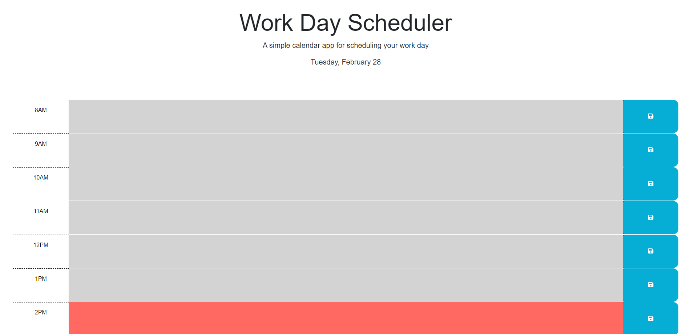
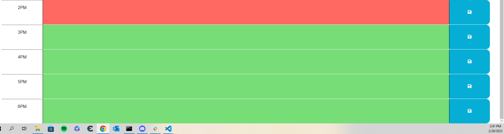

# Daily Planner

## Description

This project that I have created is a daily planner that will allow the user to schedule and track events every hour during the work day. I created this project to help myself be more organized and manage time more efficiently throughout the day. This planner will allow the user to type an event into each text area and save it. When the page is reloaded, the task will still display in the text area! Also, the planner is color-coded based on whether an event is in the past, present or future. Past hours are displayed with a gray background in the text area while the present hour is displayed with a red background and future hours are displayed with a green background.

## Installation

No installation is required for this project. You will only need to enter the URL in your browser to access this application. 

## Usage

Once you load the URL into your browser the page will display with the current date at the top of the page. 
Scroll down to access the planner. Each hour of the work day starting at 8AM and ending at 6PM will be accounted for within the planner. You can select the text area next to the corresponding hour and type whatever you want to in there. Once you click the save button, your task will be saved to local storage. When you reload the page, the task will still display under the corresponding hour. 

URL: https://thomasjshea.github.io/Daily-Planner/

## Credits

I completed this project on my own with no help. 

## License

This application uses the MIT License.